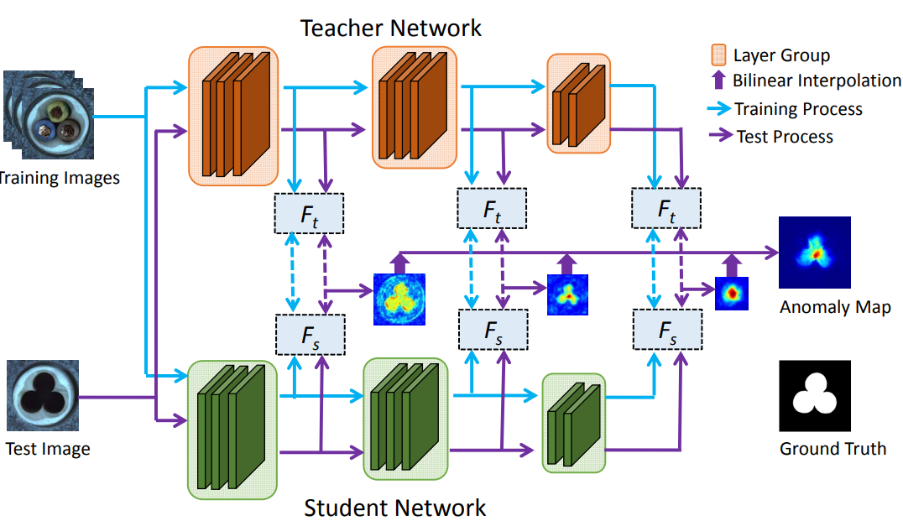
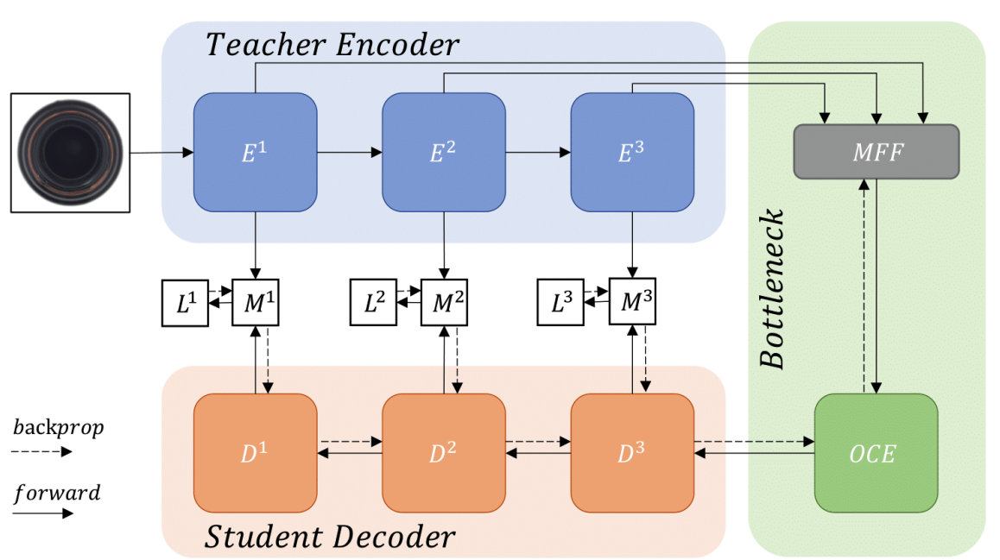
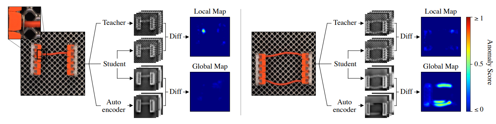
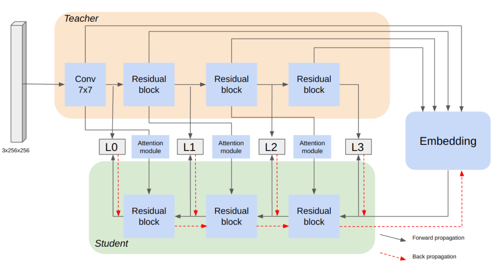
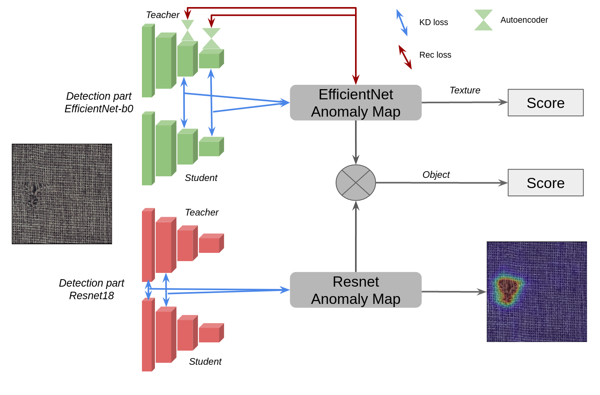
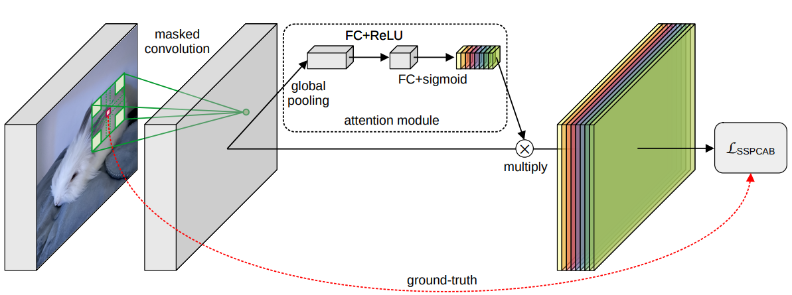

<p align="center">
  <h1><center> &#127981;&#9879; Distillation Industrial Anomaly Detection &#9879;&#127981; </center></h1>
</p>

# Description
This project aims to regroup the state-of-the-art approaches that use knowledge distillation for unsupervised anomaly detection. The code is designed to be understandable and simple to allow custom modifications.

## Getting Started

You will need [Python 3.10+](https://www.python.org/downloads) and the packages specified in _requirements.txt_.

Install packages with:

```
pip install -r requirements.txt
```


## Base usage 
### Configuration
To use the project, you must configure the config.yaml file 
This file allows configuring the main elements of the project.

- `data_path` (STR): The path to the dataset
- `distillType` (STR): The type of distillation : st for STPM, rd for reverse distillation, ead for EfficientAD, dbfad for distillation-based fabric anomaly detection, mixed for mixedTeacher
- `backbone` (STR): The name of the model backbone (any CNN for st, only resnets and wide resnets for rd, small or medium for ead)
- `out_indice` (LIST OF INT): The index of the layer used for distillation (only for st)
- `obj` (STR): The object category
- `phase` (STR): Either train or test
- `save_path` (STR): The path to save the model weights
- `training_data`(YAML LIST) : To configure hyperparameters (epochs, batch_size, img_size, crop_size and norm)

An example of config for each distillType is accessible in `configs/`

### Training and testing
Once configured, just do the following command to train or test (depending of configuration file)
```
python3 trainNet.py
```

You can also visualize the feature map of a given layer, you may change the selected layer within the python file
```
python3 visualization.py
```

# Implemented methods

## STPM : Student-Teacher Feature Pyramid Matching for Unsupervised Anomaly Detection
[Article](https://arxiv.org/pdf/2103.04257v2.pdf)  
[Code inspiration](https://github.com/xiahaifeng1995/STPM-Anomaly-Detection-Localization-master)
<p align="left">
  
</p>

## Reverse distillation : Anomaly Detection via Reverse Distillation from One-Class Embedding
[Article1](https://arxiv.org/pdf/2201.10703.pdf)  and [Article2](https://openaccess.thecvf.com/content/CVPR2023/papers/Tien_Revisiting_Reverse_Distillation_for_Anomaly_Detection_CVPR_2023_paper.pdf)  
[Code inspiration](https://github.com/tientrandinh/Revisiting-Reverse-Distillation)
<p align="left">
  
</p>

## EfficientAD : Accurate Visual Anomaly Detection at Millisecond-Level Latencies
[Article](https://arxiv.org/pdf/2303.14535.pdf)  
[Code inspiration](https://github.com/nelson1425/EfficientAD)
<p align="left">
  
</p>

## DBFAD : Distillation-based fabric anomaly detection
[Article](https://arxiv.org/pdf/2401.02287.pdf)  
[Code inspiration](https://github.com/SimonThomine/DBFAD)
<p align="left">
  
</p>

## MixedTeacher : Knowledge Distillation for fast inference textural anomaly detection 
[Article](https://arxiv.org/pdf/2306.09859.pdf) 
[Code inspiration](https://github.com/SimonThomine/MixedTeacher)
<p align="left">
  
</p>

# Implemented tools

## SSPCAB : Self-Supervised Predictive Convolutional Attentive Block for Anomaly Detection
[Article](https://arxiv.org/pdf/2111.09099.pdf)  
[Code inspiration](https://github.com/ristea/sspcab)
<p align="left">
  
</p>

## License

This project is licensed under the MIT License.